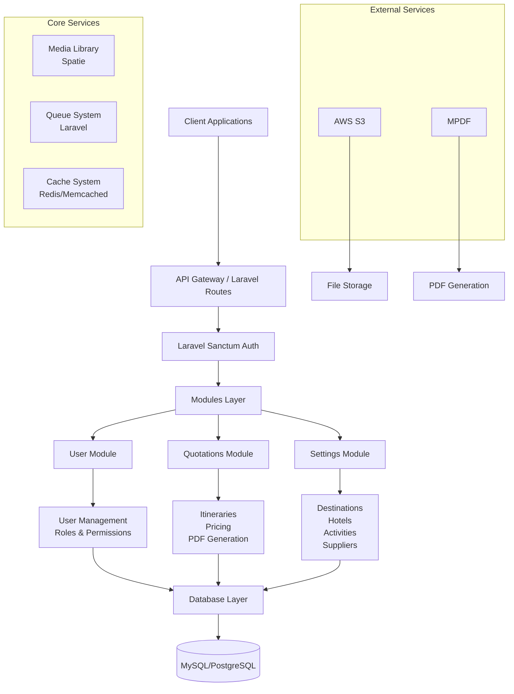

# TIC Tours Laravel 🏖️

[](https://laravel.com)
[](https://php.net)
[](https://mysql.com)
[](https://opensource.org/licenses/MIT)
[](#)

A comprehensive, enterprise-grade Laravel-based tour management system designed for travel agencies to streamline operations, manage quotations, create detailed itineraries, and handle complex travel-related configurations.

## 🏗️ Architecture Overview



## ✨ Key Features

### 👥 User Management System
- **Multi-tenant Architecture**: Role-based access control with granular permissions
- **Secure Authentication**: Laravel Sanctum for API token management
- **User Profiles**: Comprehensive user data management with audit trails
- **Permission Matrix**: Dynamic role assignment and permission management

### 📋 Quotations & Itineraries
- **Dynamic Itinerary Builder**: Create detailed day-by-day travel plans
- **Real-time Pricing Engine**: Flexible pricing calculations with currency support
- **PDF Generation**: Professional quotation documents using MPDF
- **Version Control**: Track changes and maintain quotation history

### ⚙️ Advanced Settings Management
- **Geographic Hierarchy**: Countries → Destinations → Sub-destinations
- **Accommodation Management**: Hotels with room types, amenities, and meal plans
- **Activity Catalog**: Comprehensive activity database with estimations
- **Supplier Network**: Manage agents, suppliers, and business partners
- **Market Segmentation**: Customer categories and lead sources
- **Currency Management**: Multi-currency support with exchange rates

### 🔧 Technical Features
- **Modular Architecture**: Laravel Modules for maintainable codebase
- **Media Management**: Spatie Media Library with AWS S3 integration
- **API-First Design**: RESTful API with comprehensive documentation
- **Queue Processing**: Asynchronous job processing for performance
- **Caching Layer**: Redis/Memcached support for optimal performance
- **Audit Trails**: Complete change tracking with soft deletes

## 🛠️ Tech Stack

### Backend Framework
- **Laravel 9.x**: Enterprise PHP framework with robust features
- **PHP 8.0+**: Modern PHP with performance optimizations
- **Composer**: Dependency management

### Database & Storage
- **MySQL 8.0+ / PostgreSQL**: Primary database with advanced features
- **Redis / Memcached**: High-performance caching
- **AWS S3**: Cloud file storage with CDN integration

### API & Authentication
- **Laravel Sanctum**: Token-based API authentication
- **RESTful API**: Comprehensive API endpoints
- **Rate Limiting**: Built-in API throttling

### External Integrations
- **MPDF**: Professional PDF generation
- **AWS SDK**: Cloud services integration
- **SMTP / Mail Services**: Email notifications

### Frontend Build System
- **Vite**: Lightning-fast build tool
- **Axios**: HTTP client for API communication
- **PostCSS**: CSS processing and optimization

### Development & Testing
- **PHPUnit**: Comprehensive test suite
- **Laravel Pint**: Code style enforcement
- **Laravel Sail**: Docker development environment

## 📊 Database Schema

### Core Tables
- **users**: User accounts with authentication
- **roles & permissions**: RBAC implementation
- **media**: File management (Spatie Media Library)

### Settings Module
- **countries, destinations, sub_destinations**: Geographic hierarchy
- **hotels, rooms, room_types**: Accommodation management
- **activities, activity_estimations**: Tour activities
- **suppliers, agents**: Business partners
- **currencies**: Multi-currency support
- **system_settings**: Application configuration

### Quotations Module
- **itineraries, itinerary_entries**: Travel plans
- **enquiries, customers**: Lead management
- **drafts**: Work-in-progress quotations

### Key Design Patterns
- **UUID Primary Keys**: Globally unique identifiers
- **Soft Deletes**: Data preservation with audit trails
- **Audit Fields**: Created/updated/deleted by tracking
- **Polymorphic Relations**: Flexible media attachments

## 🚀 Installation & Setup

### Prerequisites
- **PHP 8.0+** with extensions: `pdo`, `mbstring`, `openssl`, `tokenizer`, `xml`, `ctype`, `json`, `bcmath`
- **Composer** (PHP dependency manager)
- **Node.js 16+** and **NPM**
- **MySQL 8.0+** or **PostgreSQL**
- **Redis** (recommended for caching)

### Quick Start

1. **Clone Repository**
   ```bash
   git clone https://github.com/your-username/tic-laravel.git
   cd tic-laravel
   ```

2. **Install Dependencies**
   ```bash
   # PHP dependencies
   composer install

   # Node.js dependencies
   npm install
   ```

3. **Environment Configuration**
   ```bash
   cp .env.example .env
   ```
   Configure the following in `.env`:
   ```env
   APP_NAME="TIC Tours"
   APP_ENV=production
   APP_KEY=base64:your-generated-key
   APP_URL=https://your-domain.com

   # Database
   DB_CONNECTION=mysql
   DB_HOST=127.0.0.1
   DB_PORT=3306
   DB_DATABASE=tic_tours
   DB_USERNAME=your_db_user
   DB_PASSWORD=your_db_password

   # Cache & Queue
   CACHE_DRIVER=redis
   QUEUE_CONNECTION=redis
   SESSION_DRIVER=redis

   # AWS S3 (for file storage)
   AWS_ACCESS_KEY_ID=your_access_key
   AWS_SECRET_ACCESS_KEY=your_secret_key
   AWS_DEFAULT_REGION=us-east-1
   AWS_BUCKET=your-bucket-name

   # Mail Configuration
   MAIL_MAILER=smtp
   MAIL_HOST=your-smtp-host
   MAIL_PORT=587
   MAIL_USERNAME=your-email@domain.com
   MAIL_PASSWORD=your-email-password
   ```

4. **Database Setup**
   ```bash
   # Generate application key
   php artisan key:generate

   # Run migrations
   php artisan migrate

   # Seed initial data (optional)
   php artisan db:seed
   ```

5. **Build Assets**
   ```bash
   # Production build
   npm run build

   # Development (with hot reload)
   npm run dev
   ```

6. **Start Application**
   ```bash
   # Development server
   php artisan serve

   # Production (with web server)
   # Configure Apache/Nginx to serve public/ directory
   ```

### Docker Setup (Alternative)
```bash
# Using Laravel Sail
./vendor/bin/sail up -d
./vendor/bin/sail artisan migrate
./vendor/bin/sail npm run build
```

## 📚 API Documentation

### Authentication
```bash
# Register new user
POST /api/user/register
Content-Type: application/json

{
  "name": "John Doe",
  "email": "john@example.com",
  "password": "password123"
}

# Login
POST /api/user/login
Content-Type: application/json

{
  "email": "john@example.com",
  "password": "password123"
}

# Response includes access token
{
  "user": {...},
  "token": "bearer_token_here"
}
```

### Protected Endpoints
Include Bearer token in Authorization header:
```
Authorization: Bearer your_token_here
```

### Core Endpoints

#### User Management
```bash
GET    /api/user/list          # List users
GET    /api/user/info          # Current user info
PUT    /api/user/update/{id}   # Update user
DELETE /api/user/delete/{id}   # Delete user
POST   /api/user/change-password # Change password
```

#### Roles & Permissions
```bash
GET  /api/roles              # List roles
POST /api/roles              # Create role
GET  /api/permissions        # List permissions
```

#### Quotations & Itineraries
```bash
GET    /api/itineraries                    # List itineraries
POST   /api/itineraries                    # Create itinerary
GET    /api/itineraries/{id}               # Get itinerary
PUT    /api/itineraries/{id}               # Update itinerary
DELETE /api/itineraries/{id}               # Delete itinerary
POST   /api/itineraries/{id}/set-pricing   # Set pricing
POST   /api/itinerary/print/{id}           # Generate PDF
```

#### Settings Management
```bash
# Destinations
GET  /api/destinations
POST /api/destinations
GET  /api/destinations/{id}
PUT  /api/destinations/{id}
DELETE /api/destinations/{id}

# Hotels
GET  /api/hotels
POST /api/hotels
# ... similar CRUD for all settings entities

# Countries, Activities, Suppliers, etc.
GET /api/countries
GET /api/activities
GET /api/suppliers
```

### API Response Format
```json
{
  "success": true,
  "data": {...},
  "message": "Operation successful",
  "errors": null
}
```

## 🏭 Deployment

### Production Checklist
- [ ] Set `APP_ENV=production` and `APP_DEBUG=false`
- [ ] Configure proper database credentials
- [ ] Set up SSL certificate
- [ ] Configure web server (Apache/Nginx)
- [ ] Set up file permissions
- [ ] Configure cron jobs for scheduled tasks
- [ ] Set up monitoring and logging

### Nginx Configuration
```nginx
server {
    listen 80;
    server_name your-domain.com;
    root /path/to/tic-laravel/public;

    index index.php index.html;

    location / {
        try_files $uri $uri/ /index.php?$query_string;
    }

    location ~ \.php$ {
        fastcgi_pass unix:/var/run/php/php8.1-fpm.sock;
        fastcgi_index index.php;
        fastcgi_param SCRIPT_FILENAME $realpath_root$fastcgi_script_name;
        include fastcgi_params;
    }

    location ~ /\.(?!well-known).* {
        deny all;
    }
}
```

### Environment Variables for Production
```env
APP_ENV=production
APP_DEBUG=false
APP_URL=https://your-domain.com

# Security
APP_KEY=your-secure-key-here

# Database
DB_CONNECTION=mysql
DB_HOST=your-db-host
DB_DATABASE=production_db

# Cache & Queue
CACHE_DRIVER=redis
QUEUE_CONNECTION=redis
SESSION_DRIVER=redis

# File Storage
FILESYSTEM_DISK=s3

# Logging
LOG_CHANNEL=daily
LOG_LEVEL=error
```

## 🔒 Security

### Authentication & Authorization
- **Laravel Sanctum**: Secure API token management
- **Rate Limiting**: API throttling to prevent abuse
- **Password Hashing**: Bcrypt with salt
- **CSRF Protection**: Built-in Laravel security

### Data Protection
- **Input Validation**: Comprehensive validation rules
- **SQL Injection Prevention**: Eloquent ORM protection
- **XSS Protection**: Blade templating security
- **File Upload Security**: Type and size restrictions

### Best Practices
- Regular security updates
- Environment-specific configurations
- Secure credential management
- Audit logging for sensitive operations

## ⚡ Performance Optimization

### Caching Strategies
```php
// Model caching
Cache::remember('destinations', 3600, function () {
    return Destination::all();
});

// Query optimization
$itineraries = Itinerary::with(['destination', 'entries'])->get();
```

### Database Optimization
- **Indexing**: Proper indexes on frequently queried columns
- **Eager Loading**: Prevent N+1 query problems
- **Pagination**: Efficient data retrieval
- **Connection Pooling**: Database connection optimization

### Frontend Optimization
- **Asset Bundling**: Vite for optimized builds
- **Code Splitting**: Lazy loading of components
- **Image Optimization**: Responsive images with WebP support

## 🧪 Testing

### Running Tests
```bash
# Run all tests
php artisan test

# Run specific test file
php artisan test tests/Feature/UserTest.php

# Run with coverage
php artisan test --coverage
```

### Test Structure
```
tests/
├── Feature/          # Feature tests
├── Unit/            # Unit tests
├── CreatesApplication.php
└── TestCase.php
```

### Writing Tests
```php
class UserTest extends TestCase
{
    public function test_user_can_register()
    {
        $userData = [
            'name' => 'Test User',
            'email' => 'test@example.com',
            'password' => 'password123'
        ];

        $response = $this->postJson('/api/user/register', $userData);

        $response->assertStatus(201)
                ->assertJsonStructure(['user', 'token']);
    }
}
```

## 📈 Monitoring & Logging

### Laravel Logging
```php
// Info logging
Log::info('User created', ['user_id' => $user->id]);

// Error logging
Log::error('Failed to generate PDF', [
    'itinerary_id' => $id,
    'error' => $e->getMessage()
]);
```

### Health Checks
- Database connectivity
- External service availability
- Queue processing status
- File storage accessibility

## 🤝 Contributing

### Development Workflow
1. **Fork** the repository
2. **Create** a feature branch: `git checkout -b feature/amazing-feature`
3. **Commit** changes: `git commit -m 'Add amazing feature'`
4. **Push** to branch: `git push origin feature/amazing-feature`
5. **Create** Pull Request

### Code Standards
```bash
# Run code style checks
./vendor/bin/pint --test

# Fix code style
./vendor/bin/pint
```

### Commit Convention
```
feat: add new itinerary pricing feature
fix: resolve PDF generation bug
docs: update API documentation
style: format code with Pint
refactor: optimize database queries
test: add unit tests for user service
```

## 📄 License

This project is licensed under the MIT License - see the [LICENSE](LICENSE) file for details.

## 🙏 Acknowledgments

- **Laravel Framework**: For the robust PHP framework
- **Spatie**: For excellent Laravel packages
- **MPDF**: For PDF generation capabilities
- **AWS**: For cloud infrastructure services

## 📞 Support

- **Documentation**: [Wiki](https://github.com/your-username/tic-laravel/wiki)
- **Issues**: [GitHub Issues](https://github.com/your-username/tic-laravel/issues)
- **Discussions**: [GitHub Discussions](https://github.com/your-username/tic-laravel/discussions)

---

**Built with ❤️ for travel agencies worldwide**
